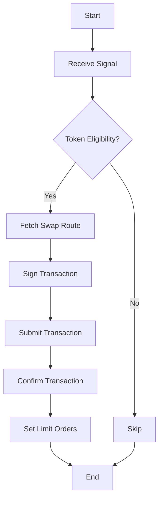
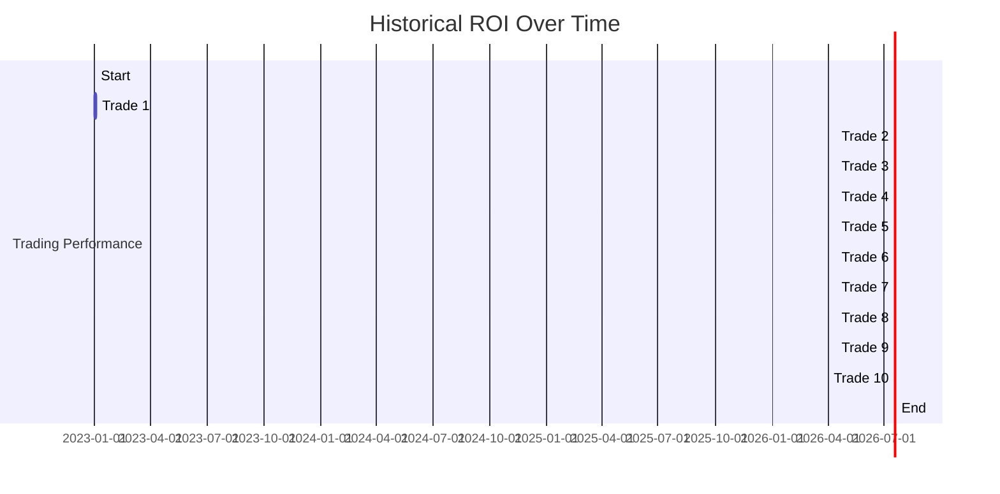

# GMGN Sniping Bot

Automated bot for sniping memecoins on Pump.fun using GMGN's Solana Trading API.

## Setup

1. **Install Node.js (v16+):**
   ```bash
   Download and install Node.js from https://nodejs.org/
   ```

2. **Clone the repository:**
   ```bash
   git clone https://github.com/yllvar/gmgn-sniping.git
   cd gmgn-sniping
   ```

3. **Install dependencies:**
   ```bash
   npm install
   ```

4. **Create `.env` from `.env.example` and fill in:**
   ```plaintext
   WALLET_PRIVATE_KEY=your_base58_private_key
   TELEGRAM_BOT_TOKEN=your_bot_token
   SOLANA_RPC=https://api.mainnet-beta.solana.com
   ```

5. **Run the bot:**
   ```bash
   npm start
   ```

## Usage

- **Monitors GMGN Telegram alerts and Solana logs for new Pump.fun pools.**
- **Executes trades for eligible tokens (liquidity >100 SOL, dev holdings <5%).**
- **Sets take-profit (3x) and stop-loss (20%) via Telegram.**

## Architecture

### System Overview

### Workflow Diagram



### Token Eligibility Checks


### Trade Execution


## Optimization Tips

### Maximize Speed

- **Use a dedicated Solana RPC node (e.g., QuickNode's Enterprise plan) to reduce latency.**
- **Set priority_fee dynamically based on network congestion (e.g., 0.002-0.01 SOL).**
- **Run the script on a low-latency server (e.g., AWS us-east-1) close to Solana's validators.**

### Enhance Filters

- **Add social sentiment analysis by integrating GMGN's Twitter/Telegram tracking (via Telegram API).**
- **Check token metadata (e.g., cute animal themes) for higher pump potential.**
- **Use GMGN's Blue Chip Index to prioritize tokens with strong holder confidence.**

### Gas Optimization

- **Batch transactions to reduce gas costs if trading multiple tokens.**
- **Monitor SOL balance and auto-refill wallet via an exchange API (e.g., Binance).**

### Backtesting

- **Simulate the strategy using historical Pump.fun data (if available via GMGN's Price Chart API) to refine parameters like slippage, liquidity thresholds, and profit targets.**
- **Example:** Test 100 trades with 0.5 SOL each, targeting 3x returns, to estimate win rate and ROI.

## Profitability Analysis

### Historical Success

- **GMGN users report flipping 1 SOL into 183 SOL by sniping early pumps, implying 200-500% returns per successful trade.**

### Win Rate

- **With strict filters (liquidity >100 SOL, dev holdings <5%, security checks), win rates can reach 60-80%, per user testimonials on X.**

### Expected ROI

- **Assuming 10 trades/day with 0.5 SOL each:**
  - **Success:** 6/10 trades hit 3x (900% total return on winners = 27 SOL).
  - **Failure:** 4/10 trades lose 50% (2 SOL loss).
  - **Net:** ~25 SOL profit/day (minus ~0.02 SOL gas fees).

### Scalability

- **Increase trade size (e.g., 1-5 SOL) for higher profits, but diversify to mitigate losses.**

## Risks and Mitigation

### High Slippage

- **Impact:** 30-50% slippage can erode profits if the token fails to pump.
- **Mitigation:** Start with lower slippage (20%) and adjust dynamically based on GMGN's price impact data. Exit losing trades quickly.

### Rug Pulls

- **Impact:** Devs with >5% holdings or mint authority can drain liquidity.
- **Mitigation:** Rely on GMGN's CA Security Check and cross-verify with tools like Dextools.io or Honeypot.is. Avoid tokens with unverified contracts.

### Transaction Failures

- **Impact:** Network congestion or low priority fees can delay trades.
- **Mitigation:** Use Anti-MEV mode (0.002 SOL priority fee) and monitor Solana's network status via https://status.solana.com.

### Market Manipulation

- **Impact:** Fake volume or social hype can lure traders into traps.
- **Mitigation:** Cross-check social sentiment with GMGN's tracking and avoid tokens with suspicious wallet activity (e.g., multiple buys from same address).

### Security Risks

- **Impact:** Compromised wallets or scripts can lead to fund loss.
- **Mitigation:** Use a dedicated trading wallet with minimal funds, enable 2FA on Telegram, and audit scripts for vulnerabilities. Store private keys offline.

## Additional Considerations

- **Capital Allocation:** Risk no more than 1-5% of your portfolio per trade (e.g., 0.5-1 SOL for a 100 SOL portfolio). Maintain a reserve for gas fees (~0.01 SOL/trade).
- **Legal Compliance:** Ensure compliance with local regulations for crypto trading, especially if using APIs or bots programmatically.
- **Testing:** Deploy the script on Solana's devnet first (https://devnet.solana.com) to test logic without real funds.
- **Community Insights:** Monitor X posts and Telegram groups (e.g., @gmgnai) for real-time tips on hot tokens, but verify independently to avoid scams.

## Line Graph Example

### Historical ROI Over Time



